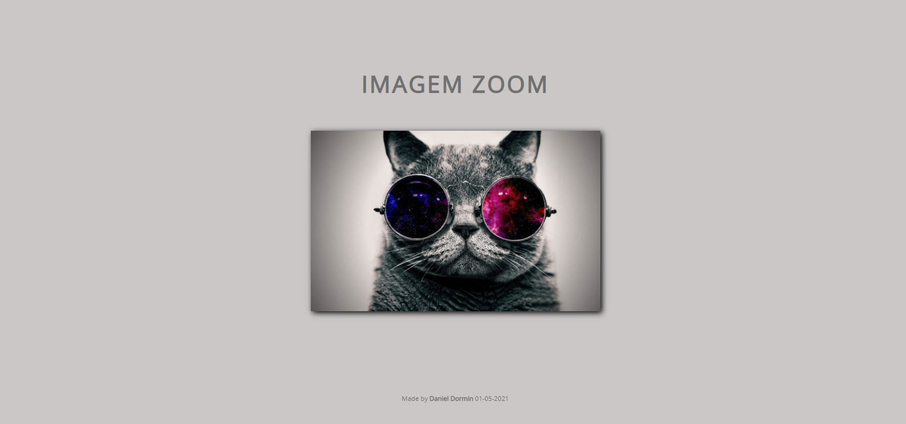

<h1 align="center">Imagem zoom</h1>

  
  <a aria-label="HTML5" href="#">
    </img>
  </a>
  <a aria-label="CSS3" href="#">
    </img>
  </a>
   <a aria-label="Javascript" href="#">
    </img>
  </a>
  <a aria-label="um dia" href="#">
    </img>
  </a>

## Descrição
Zoom em imagem  feito somente em HTML5, CSS3 e JavaScript. O projeto foi feito no quarto dia do desafio dos 100 dias.
É um projeto simples, porem foi aplicado o evento novo de mouse em cima e fora da imagem, o que será extremamente útil para proximos projetos.
01/05/2021

</img>

### Funcionando no CodePen
[CodePen](https://codepen.io/ddparkas/pen/YzNoRVN)