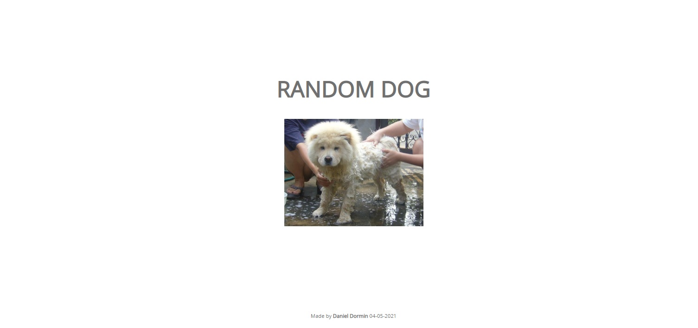

<h1 align="center">Random dog</h1>

  
  <a aria-label="HTML5" href="#">
    </img>
  </a>
  <a aria-label="CSS3" href="#">
    </img>
  </a>
   <a aria-label="Javascript" href="#">
    </img>
  </a>
  <a aria-label="um dia" href="#">
    </img>
  </a>

## Descrição
Primeira aplicação usando api feito somente em HTML5, CSS3 e JavaScript. O projeto foi feito no sexto dia do desafio dos 100 dias.
Agradeço ao professor [Roger Melo](https://www.youtube.com/channel/UCmjDevp9Y8r-qi-xueD3Izg) pela aula esclarecedora sobre promisses e funções assincronas.

05/05/2021

</img>

### Funcionando no CodePen
[CodePen](https://codepen.io/ddparkas/pen/jOBOLEp)