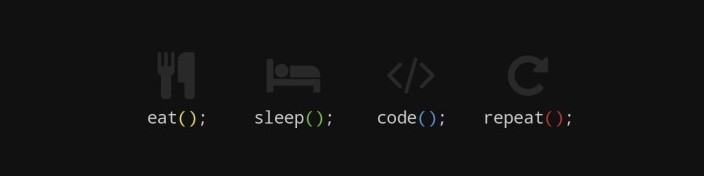

</img>

<h1 align="center">Desafio dos 100 dias</h1>

Este repositório guarda o desafio de começar e concluir um projeto por dia duarante 100 dias

  
  <a aria-label="HTML5" href="#">
    </img>
  </a>
  <a aria-label="CSS3" href="#">
    </img>
  </a>
   <a aria-label="Javascript" href="#">
    </img>
  </a>
  <a aria-label="um dia" href="#">
    </img>
  </a>

## Projetos

[1 - calculadora de IMC](./1-IMC)

[2 - Slideshow](./2-Slideshow)

[3 - Contador Regressivo](./3-Contador-regressivo)

[4 - Imagem zoom](./4-Imagem-zoom)

[5 - Rain](./5-Rain)

[6 - Rando dog](./6-Random-dog)

## Licença

[MIT](./LICENSE) &copy; [Daniel Dormin](https://ddparkas.github.io/site/)
